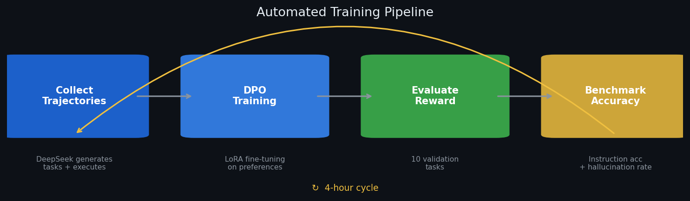
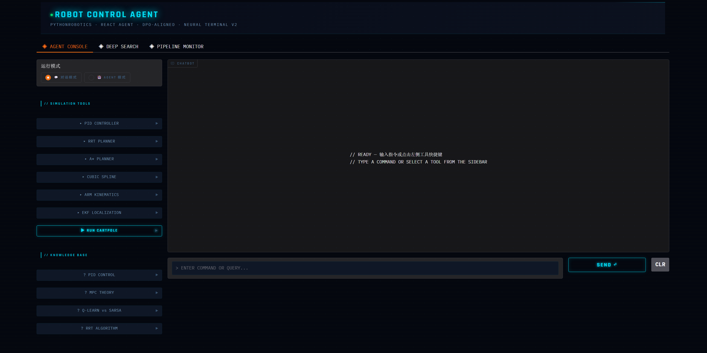
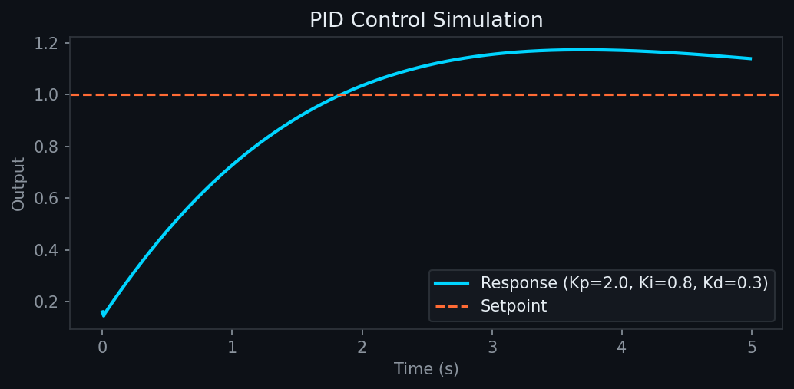
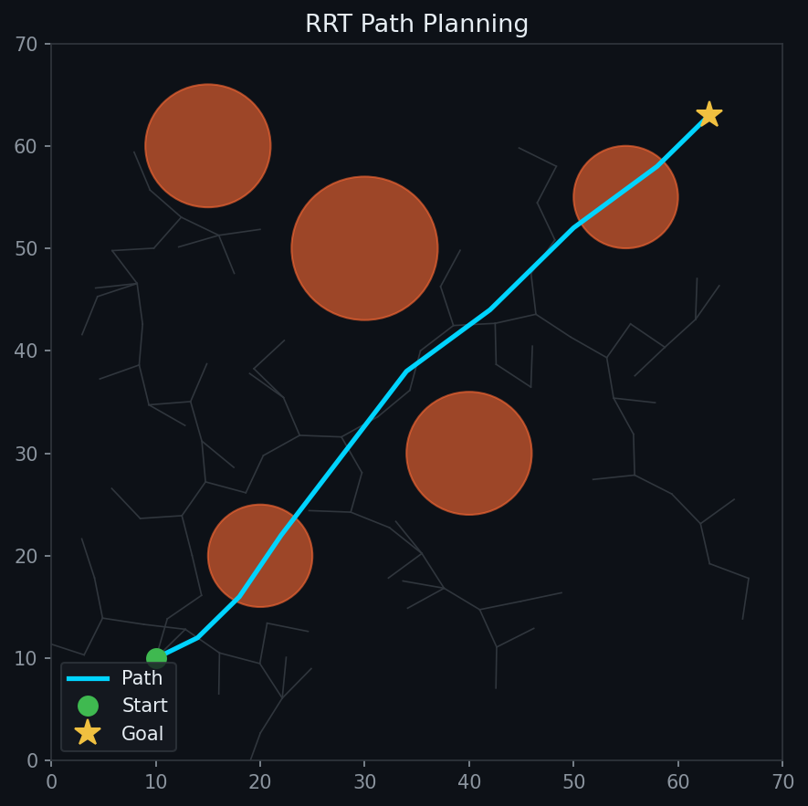
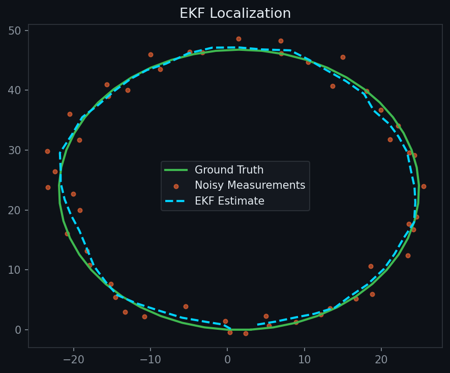

# Robot-LLM-Align

[](https://github.com/JIAlonglong/robot-llm-align)
[](./LICENSE)

> LLM preference alignment + Agent system for robot control domain

**[中文文档](./README_CN.md) | English**

---

## Overview

This project builds domain-specific datasets for robot control (PID, path planning, EKF, arm kinematics, etc.), trains aligned models via SFT → DPO, and integrates PythonRobotics tools to build a Robot Control Agent with real tool-calling capabilities.

**Two parallel tracks:**
- **Alignment**: SFT → DPO, reducing hallucinations in specialized domains
- **Agent**: ReAct loop + rule-based tool routing, letting the model actually *do things*

**Automated pipeline**: Every 4 hours — collect trajectories → DPO train → evaluate → benchmark



---

## Project Structure

```
robot-llm-align/
├── dataset/                              # Training data (gitignored runtime outputs)
│   ├── sft_combined_v2.jsonl             # General SFT data
│   ├── sft_with_tools.jsonl              # SFT data with tool calls
│   ├── dpo_pairs.jsonl                   # DPO preference pairs
│   └── dpo_train.jsonl                   # DPO training data (pipeline output)
├── scripts/
│   ├── pipeline.py                       # 4-hour automated cycle (collect→train→eval→benchmark)
│   ├── continuous_optimize.py            # 12-hour standalone prompt optimization
│   ├── train_sft.py                      # SFT training (Qwen2.5-7B + LoRA)
│   ├── train_sft_1.5b.py                 # SFT training (Qwen2.5-1.5B + LoRA)
│   ├── train_dpo.py                      # DPO training (7B)
│   ├── train_dpo_1.5b.py                 # DPO training (1.5B)
│   ├── evaluate.py                       # LLM-as-a-Judge evaluation
│   ├── agent/
│   │   ├── app.py                        # Web UI (3 tabs: Agent / Deep Search / Pipeline Monitor)
│   │   ├── agent_executor.py             # ReAct execution engine
│   │   ├── tool_registry.py              # Tool registry & dispatcher
│   │   ├── reward.py                     # Reward functions
│   │   └── tools/
│   │       └── python_robotics_tools.py  # PythonRobotics adapter
│   └── data_processing/                  # Data generation scripts
├── checkpoints/                          # Trained model weights (gitignored)
├── PythonRobotics/                       # Robot algorithm library (tool source)
└── logs/                                 # Training logs (gitignored)
```

---

## Environment Setup

### Prerequisites

- Python 3.10+, PyTorch 2.0+, CUDA 11.8+ (training only)
- conda environment: `LLM`

### Install

```bash
pip install transformers peft trl datasets accelerate bitsandbytes
pip install gradio openai arxiv
```

### Configure API Keys

```bash
export SILICONFLOW_API_KEY="your_key_here"   # Required for pipeline & deep search
export WANDB_API_KEY="your_key_here"         # Optional, for training tracking
```

Get a SiliconFlow key at [siliconflow.cn](https://siliconflow.cn) — used for DeepSeek-V3.2 task generation and prompt optimization.

---

## Quick Start

### Launch Web UI

```bash
cd /path/to/robot-llm-align
conda run -n LLM python scripts/agent/app.py

# Remote server:
ssh -L 7860:localhost:7860 user@server
# Open http://localhost:7860
```

The UI auto-loads the latest DPO pipeline checkpoint and best system prompt. Three tabs:

> **Screenshot**: after launching, take a screenshot and save it to `assets/ui_screenshot.png` — it will appear here automatically once pushed.


| Tab | Description |
|-----|-------------|
| **Agent Console** | Chat with the model; click tool buttons (PID, RRT, A*, EKF, etc.) to run tools directly |
| **Deep Search** | Search arxiv papers by keyword, get AI-generated summaries |
| **Pipeline Monitor** | View training cycle history, current checkpoint, benchmark metrics |

### Run the Automated Pipeline

```bash
# Single 4-hour cycle
conda run -n LLM python scripts/pipeline.py

# Continuous (runs indefinitely, 4h per cycle)
conda run -n LLM python scripts/pipeline.py --continuous
```

Each cycle:
1. **Collect** — DeepSeek generates tasks, rule-based agent executes them, records trajectories
2. **Train** — DPO training on collected preference pairs
3. **Evaluate** — 10 validation tasks, average reward
4. **Benchmark** — instruction accuracy (8 cases) + hallucination rate (6 cases)

Results saved to `dataset/pipeline_summary.json`.

### Standalone Prompt Optimization (12h)

```bash
conda run -n LLM python scripts/continuous_optimize.py --hours 12 --rounds-per-cycle 15
```

---

## Tool Set

| Category | Tool | Description |
|----------|------|-------------|
| Simulation | `simulate_pid(kp, ki, kd)` | PID control simulation, returns overshoot/settling time/plot |
| Simulation | `cartpole_reset()` / `cartpole_step(action)` | CartPole physics simulation |
| Path Planning | `rrt_planning(sx, sy, gx, gy)` | RRT random tree planning |
| Path Planning | `astar_planning(sx, sy, gx, gy)` | A* grid planning |
| Path Planning | `cubic_spline_planning(waypoints)` | Cubic spline trajectory |
| Control | `lqr_steering_control(x, y, yaw, v, ref_path)` | LQR tracking control |
| Localization | `ekf_localization(state, control, measurement)` | Extended Kalman Filter |
| Manipulation | `arm_forward_kinematics(joint_angles, link_lengths)` | Forward kinematics |
| Visualization | `plot_path_comparison(paths, labels)` | Multi-path comparison plot |

<table>
  <tr>
    <td><br><sub>PID Control Simulation</sub></td>
    <td><br><sub>RRT Path Planning</sub></td>
  </tr>
  <tr>
    <td><br><sub>EKF Localization</sub></td>
    <td><br><sub>4-Hour Training Pipeline</sub></td>
  </tr>
</table>

---

## Manual Training

```bash
# SFT (1.5B, GPU-friendly)
conda run -n LLM python scripts/train_sft_1.5b.py

# DPO (1.5B)
conda run -n LLM python scripts/train_dpo_1.5b.py

# Evaluation
conda run -n LLM python scripts/evaluate.py --mode all
```

---

## Tech Stack

- **Models**: Qwen2.5-1.5B-Instruct / Qwen2.5-7B-Instruct + LoRA (PEFT)
- **Training**: SFT → DPO (TRL)
- **Tools**: PythonRobotics (path planning / control / localization / manipulation)
- **Web UI**: Gradio with custom dark theme CSS
- **Data generation**: DeepSeek-V3.2 via SiliconFlow API
- **Experiment tracking**: Weights & Biases (optional)

---

## License

MIT

## Author

**JIAlonglong** — [GitHub](https://github.com/JIAlonglong)
